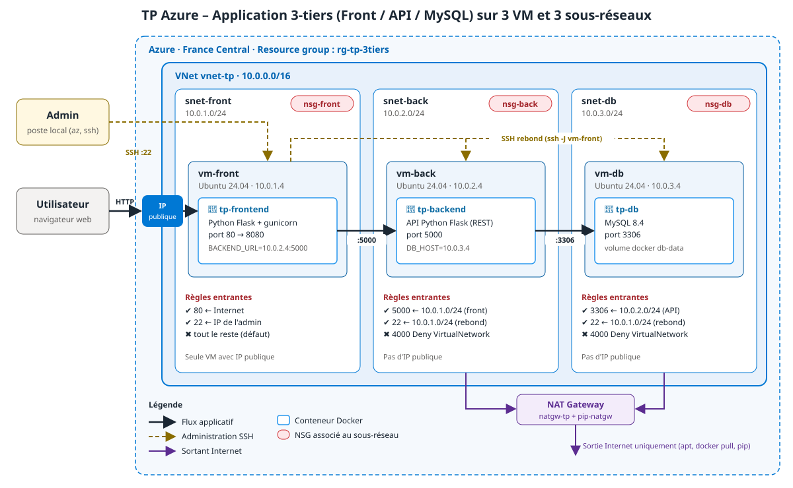

# TP Azure 3-tiers — Pas à pas 100 % portail

| | |
|---|---|
| Interface | Portail Azure (https://portal.azure.com) en **français** — libellé anglais entre parenthèses |
| Région | France Central |
| Durée | 2 h 30 environ |
| Outils | Un navigateur. **Aucun terminal, aucun script, aucune clé SSH sur le poste.** |

Toute l'infrastructure est créée par l'interface du portail. Le code de l'application arrive sur les VM depuis un dépôt GitHub, grâce à la fonction **Exécuter la commande** (*Run command*) du portail : on n'ouvre jamais de session SSH.

> Les libellés du portail évoluent : si un libellé diffère légèrement, la logique reste la même. Astuce : tapez le nom du service dans la **barre de recherche** en haut du portail plutôt que de parcourir les menus.

## Ce que vous allez construire



| Ressource | Nom | Paramètres clés |
|---|---|---|
| Groupe de ressources | `rg-tp-3tiers` | France Central |
| Réseau virtuel | `vnet-tp` | 10.0.0.0/16 |
| Sous-réseaux | `snet-front` / `snet-back` / `snet-db` | 10.0.1.0/24 / 10.0.2.0/24 / 10.0.3.0/24 |
| Groupes de sécurité réseau | `nsg-front` / `nsg-back` / `nsg-db` | un par sous-réseau |
| Passerelle NAT | `natgw-tp` + IP `pip-natgw` | sur snet-back et snet-db |
| Machines virtuelles | `vm-db` / `vm-back` / `vm-front` | Ubuntu 24.04, B1ms, IP privée 10.0.x.4 |

> ℹ️ **Différence avec le schéma** : le schéma montre un accès SSH d'administration (flèches pointillées). Dans cette variante portail, on administre les VM uniquement par **Exécuter la commande** : **le port 22 n'est ouvert nulle part**. C'est encore plus fermé.

## Sommaire

- [Étape 0 — Publier le code sur GitHub](#étape-0--publier-le-code-sur-github)
- [Étape 1 — Groupe de ressources](#étape-1--groupe-de-ressources)
- [Étape 2 — Réseau virtuel et sous-réseaux](#étape-2--réseau-virtuel-et-sous-réseaux)
- [Étape 3 — Groupes de sécurité réseau](#étape-3--groupes-de-sécurité-réseau)
- [Étape 4 — Passerelle NAT](#étape-4--passerelle-nat)
- [Étape 5 — Machine virtuelle vm-db](#étape-5--machine-virtuelle-vm-db)
- [Étape 6 — Machines virtuelles vm-back et vm-front](#étape-6--machines-virtuelles-vm-back-et-vm-front)
- [Étape 7 — Fixer les IP privées](#étape-7--fixer-les-ip-privées)
- [Étape 8 — Déployer la base de données](#étape-8--déployer-la-base-de-données)
- [Étape 9 — Déployer l'API](#étape-9--déployer-lapi)
- [Étape 10 — Déployer le front](#étape-10--déployer-le-front)
- [Étape 11 — Vérifier la segmentation](#étape-11--vérifier-la-segmentation)
- [Étape 12 — Nettoyage](#étape-12--nettoyage)

---

## Étape 0 — Publier le code sur GitHub

À faire **une seule fois** (par le formateur, ou par chaque stagiaire), depuis le site github.com.

1. Se connecter sur https://github.com → bouton **New** (ou **+** en haut à droite → **New repository**).

| Champ | Valeur |
|---|---|
| Repository name | `tp-3tiers` |
| Visibility | **Public** |
| Add a README file | décoché |

2. **Create repository**.
3. Sur la page du dépôt vide, cliquer le lien **uploading an existing file**.
4. Depuis le Finder / l'Explorateur, ouvrir le dossier `tp-3tiers` et **glisser-déposer** dans la page : les dossiers `frontend`, `backend`, `db`, `azure` et les fichiers `docker-compose.yml`, `README.md`, `architecture.svg`.
5. Attendre la fin du chargement → **Commit changes**.
6. Noter l'URL du dépôt : `https://github.com/<votre-compte>/tp-3tiers.git`.

✅ Le dépôt affiche les dossiers `frontend`, `backend`, `db`, `azure` à la racine (et non un dossier `tp-3tiers` qui les contiendrait).

> 💡 **Pourquoi ?**
>
> - Le portail Azure n'a pas de bouton pour « envoyer des fichiers » sur une VM. En revanche, une VM sait télécharger un dépôt Git public. GitHub sert donc de point de passage entre votre poste et les VM.
> - **Public** : les VM clonent le dépôt sans identifiant. Un dépôt privé exigerait un jeton d'accès, donc un secret à gérer.
> - **Structure à la racine** : les commandes des étapes 8 à 10 attendent `backend/`, `frontend/`, `db/` et `azure/` directement à la racine du dépôt.
> - Le fichier `.env` (mots de passe) n'est **jamais** publié : on le crée directement sur les VM.

---

## Étape 1 — Groupe de ressources

1. Barre de recherche → **Groupes de ressources** (*Resource groups*) → **+ Créer**.

| Champ | Valeur |
|---|---|
| Abonnement | votre abonnement de formation |
| Groupe de ressources | `rg-tp-3tiers` |
| Région | `(Europe) France Central` |

2. **Vérifier et créer** (*Review + create*) → **Créer**.

✅ `rg-tp-3tiers` apparaît dans la liste (bouton **Actualiser** si besoin).

> 💡 **Pourquoi ?**
>
> - Un groupe de ressources regroupe tout ce qui a le même cycle de vie : à la fin du TP, une seule suppression efface tout, et le coût du TP se lit d'un coup d'œil.
> - **France Central** : toutes les ressources liées (VM, disque, carte réseau, VNet) doivent être dans la même région. Elle garde aussi les données en France.

---

## Étape 2 — Réseau virtuel et sous-réseaux

1. Barre de recherche → **Réseaux virtuels** (*Virtual networks*) → **+ Créer**.
2. Onglet **Informations de base** (*Basics*) :

| Champ | Valeur |
|---|---|
| Groupe de ressources | `rg-tp-3tiers` |
| Nom du réseau virtuel | `vnet-tp` |
| Région | `(Europe) France Central` |

3. Onglet **Sécurité** (*Security*) : ne rien activer (ni Bastion, ni Pare-feu, ni Protection DDoS).
4. Onglet **Adresses IP** (*IP addresses*) :
   - **Espace d'adressage IPv4** : remplacer par `10.0.0.0/16`.
   - Sur la ligne du sous-réseau `default`, cliquer l'icône **Supprimer** (corbeille).
   - **+ Ajouter un sous-réseau** (*Add a subnet*), puis remplir et cliquer **Ajouter**. Recommencer pour chaque ligne :

| Objet du sous-réseau | Nom | Adresse de début | Taille |
|---|---|---|---|
| `Default` | `snet-front` | `10.0.1.0` | `/24` (256 adresses) |
| `Default` | `snet-back` | `10.0.2.0` | `/24` (256 adresses) |
| `Default` | `snet-db` | `10.0.3.0` | `/24` (256 adresses) |

   Dans ce panneau, laisser les champs **Passerelle NAT** et **Groupe de sécurité réseau** vides : on les associera aux étapes 3 et 4. Laisser l'option **Sous-réseau privé** (*Private subnet*) à sa valeur par défaut.

5. **Vérifier et créer** → **Créer** → **Accéder à la ressource**.

✅ `vnet-tp` → **Paramètres** → **Sous-réseaux** : trois lignes `snet-front`, `snet-back`, `snet-db` avec les bonnes plages.

> 💡 **Pourquoi ?**
>
> - **`10.0.0.0/16`** : plage privée (RFC 1918), jamais routée sur Internet. Un /16 = 65 536 adresses, large marge pour découper.
> - **Trois sous-réseaux** : un par tier. Le sous-réseau est l'unité sur laquelle on pose un pare-feu (NSG) et une sortie Internet (NAT). Séparer les tiers permet de leur appliquer des règles différentes.
> - **/24** : 256 adresses, dont **5 réservées par Azure** dans tout sous-réseau (`.0` réseau, `.1` passerelle, `.2` et `.3` DNS Azure, `.255` diffusion). La première VM d'un sous-réseau reçoit donc toujours l'adresse `.4`.
> - **Supprimer `default`** : il porte la plage `10.0.0.0/24`, inutile ici. Un réseau propre se lit mieux.
> - **Sous-réseau privé** : sur les nouveaux réseaux, une VM sans IP publique n'a **aucun accès Internet sortant** tant qu'on ne lui en donne pas un explicitement. D'où la passerelle NAT de l'étape 4.

---

## Étape 3 — Groupes de sécurité réseau

### 3.1 Créer les trois NSG

1. Barre de recherche → **Groupes de sécurité réseau** (*Network security groups*) → **+ Créer**.

| Champ | Valeur |
|---|---|
| Groupe de ressources | `rg-tp-3tiers` |
| Nom | `nsg-front` |
| Région | `(Europe) France Central` |

2. **Vérifier et créer** → **Créer**.
3. Recommencer avec `nsg-back`, puis `nsg-db`.

### 3.2 Ajouter les règles entrantes

Pour chaque règle : ouvrir le NSG → **Paramètres** → **Règles de sécurité de trafic entrant** (*Inbound security rules*) → **+ Ajouter** → remplir le panneau → **Ajouter**.

Champs communs à toutes les règles :

| Champ | Valeur |
|---|---|
| Plages de ports sources | `*` |
| Destination | `Any` |
| Service | `Custom` |

**nsg-front** — une règle :

| Source | Adresses IP / étiquette source | Plages de ports de destination | Protocole | Action | Priorité | Nom |
|---|---|---|---|---|---|---|
| `Étiquette de service` | `Internet` | `80` | `TCP` | `Autoriser` | `100` | `Allow-HTTP-Internet` |

**nsg-back** — deux règles :

| Source | Adresses IP / étiquette source | Plages de ports de destination | Protocole | Action | Priorité | Nom |
|---|---|---|---|---|---|---|
| `Adresses IP` | `10.0.1.0/24` | `5000` | `TCP` | `Autoriser` | `100` | `Allow-API-from-front` |
| `Étiquette de service` | `VirtualNetwork` | `*` | `Any` | `Refuser` | `4000` | `Deny-VNet-Inbound` |

**nsg-db** — deux règles :

| Source | Adresses IP / étiquette source | Plages de ports de destination | Protocole | Action | Priorité | Nom |
|---|---|---|---|---|---|---|
| `Adresses IP` | `10.0.2.0/24` | `3306` | `TCP` | `Autoriser` | `100` | `Allow-MySQL-from-back` |
| `Étiquette de service` | `VirtualNetwork` | `*` | `Any` | `Refuser` | `4000` | `Deny-VNet-Inbound` |

✅ Dans la liste des règles de `nsg-back`, cocher **Afficher les règles par défaut** : on voit `AllowVnetInBound` (65000), `AllowAzureLoadBalancerInBound` (65001) et `DenyAllInBound` (65500), sous vos deux règles.

### 3.3 Associer chaque NSG à son sous-réseau

1. Ouvrir `nsg-front` → **Paramètres** → **Sous-réseaux** → **+ Associer** (*Associate*).

| Champ | Valeur |
|---|---|
| Réseau virtuel | `vnet-tp` |
| Sous-réseau | `snet-front` |

2. **OK**.
3. Même chose : `nsg-back` → `snet-back`, puis `nsg-db` → `snet-db`.

✅ `vnet-tp` → **Sous-réseaux** : la colonne **Groupe de sécurité** affiche le bon NSG sur chaque ligne.

> 💡 **Pourquoi ?**
>
> - **Un NSG par sous-réseau** : chaque tier a sa propre politique d'entrée. Associé au sous-réseau, un NSG protège toutes les VM qui s'y trouvent, présentes et futures.
> - **Étiquette `Internet`** : désigne toutes les adresses publiques, sans avoir à les énumérer. Seul le front est ouvert au monde, et seulement en HTTP (80).
> - **Sources `10.0.1.0/24` et `10.0.2.0/24`** : on autorise un **sous-réseau** plutôt qu'une IP de VM. Une deuxième VM front ajoutée plus tard sera autorisée sans retoucher la règle.
> - **Pourquoi `Deny-VNet-Inbound` est indispensable** : la règle par défaut `AllowVnetInBound` (priorité 65000) autorise **tout** le trafic entre machines du même VNet. Sans votre règle de refus, le front pourrait joindre MySQL directement (port 3306), et la segmentation serait illusoire.
> - **Priorités** : les règles sont évaluées de la plus petite à la plus grande ; la première qui correspond s'applique et l'évaluation s'arrête. 100 autorise le flux légitime, 4000 refuse le reste du VNet, avant d'arriver à 65000. Les numéros espacés laissent de la place pour insérer des règles plus tard.
> - **Pas de règle SSH (22)** : on administrera les VM avec **Exécuter la commande**, qui passe par l'agent Azure installé dans la VM, sans aucun port entrant.
> - Les NSG sont **à états** (*stateful*) : les réponses d'une connexion autorisée repartent automatiquement. Inutile d'écrire des règles sortantes.

---

## Étape 4 — Passerelle NAT

1. Barre de recherche → **Passerelles NAT** (*NAT gateways*) → **+ Créer**.
2. Onglet **Informations de base** :

| Champ | Valeur |
|---|---|
| Groupe de ressources | `rg-tp-3tiers` |
| Nom de la passerelle NAT | `natgw-tp` |
| Région | `(Europe) France Central` |
| Zone de disponibilité | `Aucune zone` (*No zone*) |
| Délai d'inactivité TCP (minutes) | `4` |

3. Onglet **IP sortante** (*Outbound IP*) → **Adresses IP publiques** → **Créer une adresse IP publique** → **Nom** : `pip-natgw` → **OK**.
4. Onglet **Mise en réseau** (*Networking*, parfois nommé *Sous-réseau*) :

| Champ | Valeur |
|---|---|
| Réseau virtuel | `vnet-tp` |
| Sous-réseaux | cocher **snet-back** et **snet-db** (pas snet-front) |

5. **Vérifier et créer** → **Créer**.

✅ `vnet-tp` → **Sous-réseaux** : la colonne **Passerelle NAT** affiche `natgw-tp` sur `snet-back` et `snet-db`.

> 💡 **Pourquoi ?**
>
> - `vm-back` et `vm-db` n'ont pas d'IP publique, mais elles doivent **sortir** sur Internet pour installer Docker, télécharger le code depuis GitHub et l'image MySQL.
> - La passerelle NAT ne laisse passer que le trafic **sortant** (et ses réponses). Aucune connexion ne peut entrer par elle : les VM restent injoignables depuis Internet.
> - Toutes les VM de ces sous-réseaux sortent avec **une seule IP publique connue** (`pip-natgw`), pratique pour se faire autoriser chez un partenaire.
> - **Pas sur snet-front** : `vm-front` aura sa propre IP publique, qui lui sert aussi pour sortir.
> - **Aucune zone** : suffisant pour un TP. En production, on aligne la passerelle sur la zone des VM.

---

## Étape 5 — Machine virtuelle vm-db

Créer les VM **dans cet ordre : vm-db, vm-back, vm-front**. vm-db est décrite en entier ; l'étape 6 ne liste que les différences.

1. Barre de recherche → **Machines virtuelles** (*Virtual machines*) → **+ Créer** → **Machine virtuelle Azure**.

### Onglet Informations de base (*Basics*)

| Champ | Valeur |
|---|---|
| Groupe de ressources | `rg-tp-3tiers` |
| Nom de la machine virtuelle | `vm-db` |
| Région | `(Europe) France Central` |
| Options de disponibilité | `Aucune redondance d'infrastructure requise` |
| Type de sécurité | `Machines virtuelles de lancement fiable` (*Trusted launch*) |
| Image | `Ubuntu Server 24.04 LTS - x64 Gen2` |
| Architecture de machine virtuelle | `x64` |
| Taille | `Standard_B1ms` (1 vCPU, 2 Gio) — lien **Afficher toutes les tailles** si absente |
| Type d'authentification | `Mot de passe` |
| Nom d'utilisateur | `azureuser` |
| Mot de passe / Confirmer | un mot de passe fort (12 caractères min., majuscule, minuscule, chiffre, symbole) |
| Ports d'entrée publics | `Aucun` |

### Onglet Disques (*Disks*)

| Champ | Valeur |
|---|---|
| Type de disque du système d'exploitation | `SSD Standard (stockage localement redondant)` |
| Supprimer avec la machine virtuelle | coché |

### Onglet Mise en réseau (*Networking*)

| Champ | Valeur |
|---|---|
| Réseau virtuel | `vnet-tp` |
| Sous-réseau | `snet-db (10.0.3.0/24)` |
| IP publique | `Aucun` |
| Groupe de sécurité réseau de la carte réseau | `Aucun` |
| Supprimer l'adresse IP publique et la carte réseau quand la machine virtuelle est supprimée | coché |
| Options d'équilibrage de charge | `Aucun` |

### Onglet Gestion (*Management*)

| Champ | Valeur |
|---|---|
| Activer l'arrêt automatique | coché, `19:00`, fuseau `(UTC+01:00) Bruxelles, Copenhague, Madrid, Paris` |

### Onglet Surveillance (*Monitoring*)

| Champ | Valeur |
|---|---|
| Diagnostics de démarrage | `Activer avec un compte de stockage managé (recommandé)` |

### Onglets Avancé et Balises

Laisser par défaut.

2. **Vérifier et créer** → vérifier le récapitulatif → **Créer**.
3. Attendre **Votre déploiement a été effectué** (1 à 2 minutes).

✅ `vm-db` → **Vue d'ensemble** : **Adresse IP privée** = `10.0.3.4`, **Adresse IP publique** vide.

> 💡 **Pourquoi ?**
>
> - **Ubuntu 24.04 LTS Gen2** : version à support long (5 ans). Gen2 = démarrage UEFI, requis pour le lancement fiable.
> - **Lancement fiable** : Secure Boot + vTPM. Seuls des chargeurs et noyaux signés peuvent démarrer, ce qui protège contre les rootkits, sans surcoût.
> - **`Standard_B1ms`** : série « burstable » peu chère, 2 Gio de RAM, suffisant pour MySQL ou un petit conteneur Python.
> - **Mot de passe** plutôt que clé SSH : comme aucun port SSH n'est ouvert, le mot de passe ne sert qu'en secours (console série). Cela évite aussi la gestion d'un fichier de clé privée.
> - **Ports d'entrée publics `Aucun`** et **IP publique `Aucun`** : la base de données ne doit jamais être joignable depuis Internet.
> - **NSG de carte réseau `Aucun`** : le filtrage est déjà assuré par `nsg-db` sur le sous-réseau. Un second NSG sur la carte imposerait d'ouvrir chaque flux **deux fois** et compliquerait le diagnostic.
> - **Arrêt automatique** : une VM de TP oubliée le soir coûte toute la nuit. L'arrêt automatique la **désalloue** (le calcul n'est plus facturé).
> - **Diagnostics de démarrage** : capture d'écran et journal de la console, consultables si la VM ne répond plus. Le stockage managé évite de créer un compte de stockage.
> - **`10.0.3.4`** : première adresse libre de `snet-db` (les adresses `.0` à `.3` sont réservées par Azure).

---

## Étape 6 — Machines virtuelles vm-back et vm-front

Refaire l'étape 5 deux fois en changeant uniquement ces champs.

**vm-back**

| Onglet | Champ | Valeur |
|---|---|---|
| Informations de base | Nom de la machine virtuelle | `vm-back` |
| Mise en réseau | Sous-réseau | `snet-back (10.0.2.0/24)` |
| Mise en réseau | IP publique | `Aucun` |

**vm-front**

| Onglet | Champ | Valeur |
|---|---|---|
| Informations de base | Nom de la machine virtuelle | `vm-front` |
| Informations de base | Ports d'entrée publics | `Aucun` |
| Mise en réseau | Sous-réseau | `snet-front (10.0.1.0/24)` |
| Mise en réseau | IP publique | **(nouveau) vm-front-ip** — cliquer **Créer** si besoin : Référence SKU `Standard`, Affectation `Statique` |
| Mise en réseau | Groupe de sécurité réseau de la carte réseau | `Aucun` |

✅ Les trois VM sont à l'état **En cours d'exécution** (*Running*). Noter l'**Adresse IP publique** de `vm-front` (page **Vue d'ensemble**).

> 💡 **Pourquoi ?**
>
> - Seule `vm-front` a une IP publique : c'est l'unique porte d'entrée de l'application.
> - **Ports d'entrée publics `Aucun`** même sur le front : l'ouverture du port 80 est déjà faite par `nsg-front`. Le portail ne doit pas créer de règle supplémentaire (en particulier pas de SSH ouvert à tout Internet).
> - **IP `Standard` statique** : l'adresse ne change pas quand la VM est arrêtée puis redémarrée, et elle est fermée par défaut (seul le NSG décide de ce qui entre).

---

## Étape 7 — Fixer les IP privées

À faire pour chacune des trois VM.

1. Ouvrir la VM → **Mise en réseau** (*Networking*) → **Paramètres réseau** (*Network settings*).
2. Cliquer sur le nom de la **Interface réseau / Configuration IP** (lien `vm-xxxNNN`, en haut de la page).
3. Sur la page de la carte réseau → **Paramètres** → **Configurations IP** (*IP configurations*) → cliquer `ipconfig1`.

| Champ | vm-db | vm-back | vm-front |
|---|---|---|---|
| Allocation | `Statique` | `Statique` | `Statique` |
| Adresse IP privée | `10.0.3.4` | `10.0.2.4` | `10.0.1.4` |

4. **Enregistrer**.

✅ Sur chaque VM → **Vue d'ensemble** : l'adresse IP privée attendue.

> 💡 **Pourquoi ?**
>
> - Le front appelle l'API à l'adresse `10.0.2.4`, et l'API appelle MySQL à l'adresse `10.0.3.4` : ces adresses sont écrites dans les fichiers de configuration du dépôt (`azure/deploy/*/compose.yml`).
> - En allocation **dynamique**, Azure garde l'adresse tant que la carte réseau existe, mais rien ne la garantit. **Statique** la fige.
> - Le portail ne permet pas de choisir l'IP pendant la création de la VM, d'où cette étape après coup.

---

## Étape 8 — Déployer la base de données

On utilise **Exécuter la commande** : le portail envoie un petit script à l'agent Azure de la VM, qui l'exécute en administrateur et affiche le résultat.

1. `vm-db` → **Opérations** → **Exécuter la commande** (*Run command*) → **RunShellScript**.
2. Coller le texte suivant en remplaçant :
   - `<votre-compte>` par votre compte GitHub ;
   - les deux mots de passe par les vôtres (sans espace ni `$`). **Notez-les** : ils servent aussi à l'étape 9.

```bash
apt-get -o DPkg::Lock::Timeout=300 update -q
apt-get -o DPkg::Lock::Timeout=300 install -y -q docker.io docker-compose-v2 git
git clone https://github.com/<votre-compte>/tp-3tiers.git /opt/tp-3tiers || git -C /opt/tp-3tiers pull
cd /opt/tp-3tiers
cat > .env <<'EOF'
MYSQL_ROOT_PASSWORD=RootMotDePasse2026
DB_NAME=tpdb
DB_USER=appuser
DB_PASSWORD=AppMotDePasse2026
EOF
docker compose --project-directory . -f azure/deploy/vm-db/compose.yml up -d
docker ps
```

3. **Exécuter**. Attendre la fin (2 à 4 minutes) : la sortie s'affiche sous le bouton.

✅ La dernière ligne de la sortie montre le conteneur `tp-db` avec l'état `Up` et le port `0.0.0.0:3306->3306/tcp`.

> 💡 **Pourquoi ?**
>
> - **Exécuter la commande** passe par l'agent Azure présent dans la VM, sans SSH, sans port ouvert, sans IP publique. Chaque exécution est tracée dans le **Journal d'activité**.
> - **`DPkg::Lock::Timeout`** : au premier démarrage, Ubuntu lance ses mises à jour automatiques, qui verrouillent `apt`. On attend que le verrou se libère au lieu d'échouer.
> - **`docker.io` + `docker-compose-v2`** : le moteur Docker et la commande `docker compose`. **`git`** : pour télécharger le dépôt.
> - **`.env`** : les mots de passe restent sur la VM et ne sont jamais publiés sur GitHub. Docker Compose lit automatiquement ce fichier.
> - **`--project-directory .`** : les chemins du fichier compose (`./db/init.sql`) sont résolus depuis la racine du dépôt.
> - **`db/init.sql`** : exécuté automatiquement par l'image MySQL au premier démarrage. Il crée la table `tasks` et quelques données.
> - Les téléchargements passent par la passerelle NAT de l'étape 4. Sans elle, `apt-get` échouerait par expiration du délai.

---

## Étape 9 — Déployer l'API

1. `vm-back` → **Opérations** → **Exécuter la commande** → **RunShellScript**.
2. Coller, avec **les mêmes valeurs** `DB_NAME`, `DB_USER` et `DB_PASSWORD` qu'à l'étape 8 :

```bash
apt-get -o DPkg::Lock::Timeout=300 update -q
apt-get -o DPkg::Lock::Timeout=300 install -y -q docker.io docker-compose-v2 git
git clone https://github.com/<votre-compte>/tp-3tiers.git /opt/tp-3tiers || git -C /opt/tp-3tiers pull
cd /opt/tp-3tiers
cat > .env <<'EOF'
DB_NAME=tpdb
DB_USER=appuser
DB_PASSWORD=AppMotDePasse2026
EOF
docker compose --project-directory . -f azure/deploy/vm-back/compose.yml up -d --build
sleep 10
curl -s http://localhost:5000/health
```

3. **Exécuter** (3 à 5 minutes : construction de l'image Python).

✅ La dernière ligne affiche `{"database":"up","host":"...","status":"ok"}`. L'API joint donc MySQL à travers `nsg-db`.

> 💡 **Pourquoi ?**
>
> - **`--build`** : l'image de l'API est construite sur la VM à partir de `backend/Dockerfile`. Aucun registre d'images n'est nécessaire.
> - **Mêmes identifiants** : l'API se connecte à MySQL avec `appuser`, l'utilisateur créé par MySQL à l'étape 8.
> - **`/health`** : l'API exécute `SELECT 1` sur la base. `"database":"up"` prouve à la fois que le conteneur MySQL fonctionne et que la règle `Allow-MySQL-from-back` laisse passer le flux.
> - Si vous obtenez `"database":"down"`, vérifiez le mot de passe dans les deux `.env` et l'IP statique `10.0.3.4` de vm-db.

---

## Étape 10 — Déployer le front

1. `vm-front` → **Opérations** → **Exécuter la commande** → **RunShellScript**.
2. Coller :

```bash
apt-get -o DPkg::Lock::Timeout=300 update -q
apt-get -o DPkg::Lock::Timeout=300 install -y -q docker.io docker-compose-v2 git
git clone https://github.com/<votre-compte>/tp-3tiers.git /opt/tp-3tiers || git -C /opt/tp-3tiers pull
cd /opt/tp-3tiers
docker compose --project-directory . -f azure/deploy/vm-front/compose.yml up -d --build
docker ps
```

3. **Exécuter**.
4. Dans un nouvel onglet du navigateur : `http://<IP publique de vm-front>`.

✅ La page **Mes tâches** s'affiche. Les trois cartes **Front**, **API** et **MySQL** sont **UP**, avec les noms d'hôte `vm-front` et `vm-back`. Ajouter, cocher et supprimer une tâche fonctionne.

> 💡 **Pourquoi ?**
>
> - Le front n'a pas besoin de `.env` : il ne connaît que l'adresse de l'API (`http://10.0.2.4:5000`, écrite dans son fichier compose).
> - **Le navigateur ne parle qu'au front.** C'est le serveur front qui appelle l'API sur le réseau privé : l'API n'a jamais besoin d'être exposée sur Internet.
> - Le port 80 de la VM est redirigé vers le port 8080 du conteneur, et `nsg-front` autorise le port 80 depuis Internet.
> - Les noms d'hôte affichés prouvent que chaque tier tourne bien sur sa propre VM.

---

## Étape 11 — Vérifier la segmentation

### 11.1 Tests depuis les VM

Sur `vm-front` → **Exécuter la commande** → **RunShellScript** :

```bash
echo "Front -> API   :"; curl -s --max-time 5 http://10.0.2.4:5000/health || echo "BLOQUE"
echo "Front -> MySQL :"; nc -zvw5 10.0.3.4 3306 2>&1 || echo "BLOQUE"
```

Sur `vm-db` → **Exécuter la commande** → **RunShellScript** :

```bash
echo "Sortie Internet via :"; curl -s --max-time 5 https://api.ipify.org
```

| Test | Résultat attendu | Règle responsable |
|---|---|---|
| Front → API (5000) | ✅ JSON `status: ok` | `Allow-API-from-front` (nsg-back) |
| Front → MySQL (3306) | ❌ `timed out` puis `BLOQUE` | `Deny-VNet-Inbound` (nsg-db) |
| Sortie Internet de vm-db | ✅ l'IP de `pip-natgw` | passerelle NAT |

### 11.2 Vérification du flux IP (Network Watcher)

1. Barre de recherche → **Network Watcher** → **Outils de diagnostic réseau** → **Vérification du flux IP** (*IP flow verify*).
2. Remplir, puis **Vérifier** (*Check*) :

| Test | Machine virtuelle | Direction | Protocole | Adresse IP locale | Port local | Adresse IP distante | Port distant | Résultat attendu |
|---|---|---|---|---|---|---|---|---|
| A | `vm-back` | Entrant | TCP | `10.0.2.4` | `5000` | `10.0.1.4` | `60000` | Autorisé — `Allow-API-from-front` |
| B | `vm-db` | Entrant | TCP | `10.0.3.4` | `3306` | `10.0.1.4` | `60000` | Refusé — `Deny-VNet-Inbound` |
| C | `vm-db` | Entrant | TCP | `10.0.3.4` | `3306` | `10.0.2.4` | `60000` | Autorisé — `Allow-MySQL-from-back` |
| D | `vm-back` | Entrant | TCP | `10.0.2.4` | `5000` | `8.8.8.8` | `60000` | Refusé — `DenyAllInBound` |

### 11.3 Règles de sécurité effectives

`vm-db` → **Mise en réseau** → **Paramètres réseau** → lien de la carte réseau → **Aide** → **Règles de sécurité effectives** (*Effective security rules*) : la liste fusionne les règles de `nsg-db` et les règles par défaut, dans leur ordre d'évaluation.

> ❓ **Question** : supprimez temporairement la règle `Deny-VNet-Inbound` de `nsg-db`, puis refaites le test B et le test « Front → MySQL ». Que constatez-vous ? Pourquoi ? Remettez ensuite la règle.

> 💡 **Pourquoi ?**
>
> - Une application qui fonctionne ne prouve pas que la sécurité est en place : il faut aussi vérifier que ce qui **doit** être bloqué l'est réellement.
> - **Vérification du flux IP** simule un paquet et indique la règle exacte qui l'autorise ou le bloque, sans envoyer de vrai trafic.
> - **`60000`** : un port source quelconque. Un client utilise un port aléatoire élevé, et les règles filtrent sur le port de destination.
> - **Test D** : `8.8.8.8` représente n'importe quelle adresse d'Internet. Ce n'est pas `Deny-VNet-Inbound` qui bloque (la source n'est pas dans le VNet), mais la règle par défaut `DenyAllInBound`.
> - **Règles effectives** : indispensable quand un NSG est posé à la fois sur le sous-réseau et sur la carte réseau. Ici il n'y en a qu'un, ce qui rend la lecture simple.

---

## Étape 12 — Nettoyage

1. Barre de recherche → **Groupes de ressources** → `rg-tp-3tiers`.
2. **Supprimer le groupe de ressources**.
3. Saisir `rg-tp-3tiers` dans le champ de confirmation → **Supprimer**.
4. Après quelques minutes, la cloche 🔔 confirme la suppression. **Actualiser** la liste : le groupe a disparu.
5. Sur GitHub, si le dépôt ne sert plus : **Settings** → tout en bas **Delete this repository**.

> 💡 **Pourquoi ?**
>
> - Supprimer le groupe efface d'un coup les VM, disques, cartes réseau, IP publiques, passerelle NAT, NSG et VNet.
> - La passerelle NAT et les IP publiques sont facturées **à l'heure, même VM arrêtées** : ne laissez pas le groupe en place entre deux sessions.
